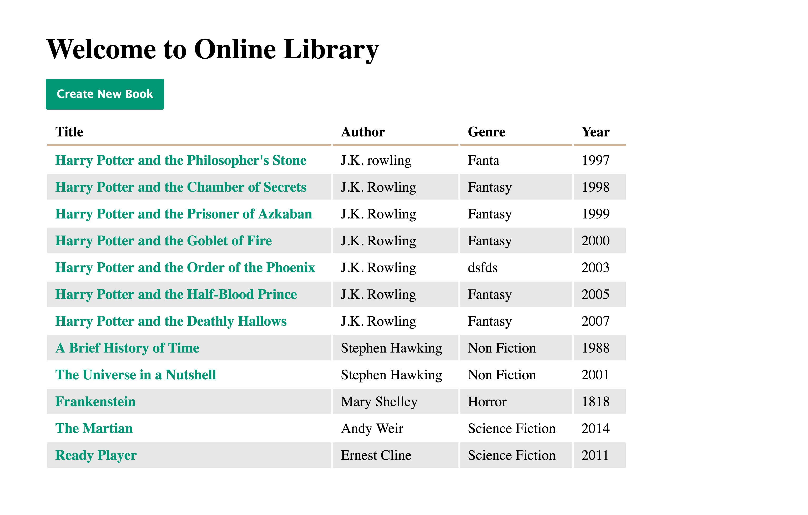

# SQL Library Manager

> Application for library to help them manage their collection of books. App that'll include pages to list, add, update, and delete books.

## Features

* Uses Sequelize Model validation to ensure that the title and author properties will have values when the form is submitted
* If title or author fields are empty, form will not submit and page shows friendly error message
* If routing to a non-existent book id, project uses a global error handler to render a friendly error page
* If navigating to a non-existent route like /error, the project renders a user friendly "Page Not Found" page

## Technologies

* JavaScript
* SQL (ORM Sequelize)
* Node.js
* Express
* Pug
* CSS
* HTML

## To start server locally

* Run `npm install`

* Then `npm start`

Open [http://localhost:3000](http://localhost:3000) to view it in the browser

## Demo

Active demo: [SQL Library Manager](https://sql-library-p8.herokuapp.com)

## Screenshot

## Status

Project is: _COMPLETED_

## Inspiration

Treehouse Techdegree: FSJS project 8 - SQL Library Manager

## Contact

Created by [@Annes](https://twitter.com/annesCode)
